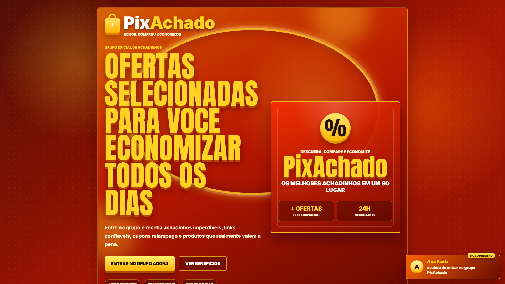

# PixAchado Landing Page

Landing page estatica para captura de leads do grupo oficial PixAchado, com foco em comunicacao promocional, chamada direta para WhatsApp e prova social simulada.



## Objetivo

Criar uma pagina simples, responsiva e chamativa para incentivar visitantes a entrarem no grupo de achadinhos, mantendo a identidade visual em tons de vermelho, laranja e amarelo/dourado.

## Funcionalidades

- Hero section com chamada principal de alto impacto.
- CTA para entrada no grupo via WhatsApp.
- Bloco de beneficios com argumentos de conversao.
- Popup automatico simulando novos membros entrando no grupo.
- Favicon configurado com `favicon.png`.
- Layout responsivo para desktop e mobile.
- Estrutura separada em HTML, CSS e JavaScript.

## Tecnologias

- HTML5
- CSS3
- JavaScript vanilla
- Google Fonts

## Estrutura do projeto

```text
.
+-- assets/
|   +-- preview.png
+-- favicon.png
+-- index.html
+-- LICENSE.txt
+-- README.md
+-- RELEASE.md
+-- script.js
+-- style.css
```

## Como usar

Abra o arquivo `index.html` diretamente no navegador ou publique a pasta em qualquer hospedagem estatica.

Antes de publicar, atualize os links dos botoes no `index.html`:

```html
https://wa.me/seunumerowhatsapp
```

Substitua pelo numero ou link oficial do grupo.

## Deploy

Este projeto pode ser publicado em servicos como GitHub Pages, Netlify, Vercel ou qualquer servidor estatico.

## Licenca

Distribuido sob a licenca MIT. Consulte `LICENSE.txt` para mais informacoes.
